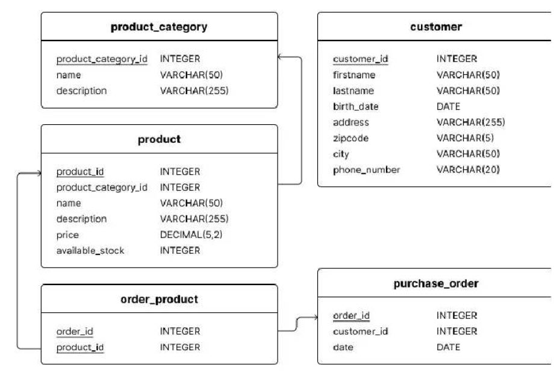

# CodinGame for Work: C#, SQL
- Campaign: Net Developer C# - Senior
- Language: English

## Question 1: Count and null values
You are working with the following table, called: ratings
| id | rating |
|----|--| 
|1 | 0.47 |
| 2 | null |
| 3 | 0.77 |
| 4 | 0.41 |
| 5 | null |
| 6 | 0.97 |
| 7 | 0.65 |
| 8 | null |
| 9 | 0.05 |
| 10 | 0.59 |

 Which querie(s) return the number of rows with non-null rating ? (7 rows in that example).


**Réponse**
- [x] `SELECT COUNT(rating) FROM ratings`
- [ ] `SELECT COUNT(*) FROM ratings`
- [x] `SELEC SUM (CASE WHEN rating IS NULL THEN 0 ELSE 1 END) FROM ratings`
- [ ] `SELECT SUM(rating) FROM ratings`

<br>

## Question 2: "CASE WHEN" and "GROUP BY" errors
You are working with the following tables:


You want to compute the number of orders for two product price ranges:

```
SELECT
CASE
    WHEN p.price < 100 THEN '<100'
    ELSE '>=100', COUNT(op.order_id)
FROM product p
LEFT JOIN order_product op ON p.product_id = op.product_id
```
Why does the above query generate an error? (There may be more than one reason.)


**Réponse**
- [x] The `END` keyword is missing in the `CASE WHEN` syntax
- [x] A `GROUP BY` clause is missing
- [ ] A `WHERE` clause is missing
- [ ] Another `WHEN` keyword is missing in the `CASE WHEN` syntax
- [ ] Another `THEN` keyword is missing in the `CASE WHEN` syntax

<br>

## Question 3: IN keyword understanding
Select the querie(s) that will return the same results as:

```
SELECT *
FROM product
WHERE product_id IN (2,3,6)
```

**Réponse**
- [x] 
```
SELECT *
FROM product
WHERE
product_id = 2
OR product_id = 3
OR product_id = 6
```
- [ ] 
```
SELECT *
FROM product
WHERE product_id = (2,3,6)
```
- [ ] 
```
SELECT *
FROM product
WHERE
product_id = 2
AND product_id = 3
AND product_id = 6
```
- [ ] 
```
SELECT *
FROM product
WHERE product_id BETWEEN (2,3,6)
```
- [x] 
```
SELECT *
FROM product
WHERE
product_id BETWEEN 2 AND 6
AND product_id NOT IN (4, 5)
```

<br>

## Question 4: Alias and GROUP BY error
You are working with the following table, called product :

| PRODUCT_ID | NAME |
-------------|------|
| 1 | High-tech |
| 2 | Food |
| 3 | Book |
| 4 | Book |
| 5 | Book |
| 6 | Service |
| 7 | Service |
| 8 | Service |
| 9 | Food |
|10|Food|

The field "NAME" contains the name of the product category, not the name of the product itself.

Which query should you write to count the number of products per category?

**Réponse**
- [x] ```SELECT
name AS product_category
,COUNT(product_id )
FROM product
GROUP BY name```
- [ ] ```SELECT
name AS product_category
,COUNT(product_id)
FROM product```
- [ ] ```SELECT
name AS product_category
,COUNT(product_id)
FROM product
GROUP BY product_category```
- [ ] ```SELECT
name AS product_category
,COUNT(product_id)
FROM product
GROUP BY name AS product_category```
- [ ] ```SELECT
name AS product_category, COUNT(product_id)
FROM product
GROUP BY product_id```

<br>

## Question 5: Simple WHERE condition (equality)


Write a query that returns all countries whose annual average alcohol consumption per person is 0 liters
(i.e. total_consumption is 0). 

Requirements 

Expected column: country. 
Sort the rows by country ascending. 
Example:
| COUNTRY |
|----------|
| Afghanistan |
| Kuwait |
| Somalia |

**Réponse**
```
SELECT country
FROM alcohol_consumption
WHERE total_consumption = 0
ORDER BY country ASC
```

<br>

## Question 6: SQL - OUTER JOIN


Modify the query to list all the products and their associated categories if they have one. Return no value
(null will be displayed by default) as the category otherwise.

Output only the PRODUCT_NAME and CATEGORY_NAME columns in that order.

Example of output:
| PRODUCT_NAME | CATEGORY_NAME |
---------------|---------------|
| ProForm 6.0 RT | Fitness |
| Wilwood 260-11179 | Automotive |
| HC-SR04 | null |

**Réponse**
```
SELECT p.name, pc.name
FROM product p LEFT JOIN product_category pc
ON p.product_category_id = pc.PRODUCT_CATEGORY_ID
```


## Question 7: Multiple inheritance
A C# class can have more than one parent class.

**Réponse**
- [ ] True
- [x] False

<br>

## Question 8: Size of a string
Which property returns the number of characters (= number of Char objects) in a string?

**Réponse**
- [ ] Size
- [x] Length
- [ ] Measure
- [ ] Dimension
- [ ] Width
- [ ] Limit

<br>

## Question 9: Unused Out Parameter (C# 7)
What is the best way of declaring an out parameter that is never going to be used?

**Réponse**
- [ ] ```var isParsed = int.TryParse("1", _) ;```
- [x] ```var isParsed = int.TryParse("1", out _ );```
- [ ] ```var isParsed = int.TryParse("1", _ out);```
- [ ] ```var isParsed = int.TryParse("1", out int _ );```
- [ ] ```var isParsed = int.TryParse("1", out int unused);```

<br>

## Question 10: Structures


This program displays...

**Réponse**
- [ ] null
- [ ] 0
- [x] 5
- [ ] 10

<br>

## Question 11: Out Parameter
How can an out parameter be used in C#?
Multiple answers expected.

**Réponse**
- [x] `int.TryParse(str, out int num)`
- [x] `int.TryParse(str, out num)`
- [ ] `int.TryParse(str, int num out)`
- [ ] `int.TryParse(str, num out)`

<br>

## Question 12: Null-coalescing Assignment
What is the preferred alternative implementation of the example below?

```
int? number = null;
...
if (number == null)
{
    number = 1;
}
```


**Réponse**
- [ ] 
```
    int? number = null;
    ...
    if (number == null) number = 1;
```
- [ ] 
```
    int? number = null;
    ...
    number = number == null ? number : 1;
```
- [ ] 
```
    int? number = null;
    ...
    number = number ?? 1;
```
- [x] 
```
    int? number = null;
    ...
    number ??= 1;
```

<br>

## Question 13: Last item from a list (System.Index based indexitem retrieval)
Select the preferred way of returning the last item from a list?

**Réponse**
- [ ] `var result = list[^0]`
- [x] `var result = list[^1]`
- [ ] `var result = list[-0]`
- [ ] `var result = list[-1]`
- [ ] `var result = list[list.Count -1]`
- [ ] `var result = list[list.Count]`

<br>

## Question 14: Largest wins from chaos
`Algorithm.FindLargest(int[] numbers)` should return the largest number from `numbers`. 
The array numbers always contains at least one number.

Implement `Algorithm.FindLargest(int[] numbers)`.

**Réponse**
```
using System;
public class Algorithm
{
    /// Finds the largest number in the <c>numbers</c> array.
    public static int FindLargest(int[] numbers)
    {
        int largest = numbers[0];

        for (int i = 0; i < numbers.Length; i++) {
            if (largest < numbers[i])
                largest = numbers[i];
        }

        return largest;
    }
}
```

<br>

## Question 15: Simple boolean expression
`A.Test(int i, int j)` should return true if one of the arguments equals 1 or if their sum is equal to 1.

For example:
`A.Test(1, 5)` returns true
`A.Test(2, 3)` returns false
`A.Test(-3, 4)` returns true

**Réponse**
```
using System;

class A
{
    static bool a(int i, int j)
    {
        return i + j == 1 || i == 1 || j == 1;
    }
}
```

<br>

## Question 16: Reshape String
The `Reshape(n, s tr)` method should return the string str without spaces and layed out in lines of at most n characters.

Examples:
Call Returned String

`Reshape(3, "abc de fghij")`

abc \
def \
ghi \
j

`Reshape(2, "1 23 456")`

12 \
34 \
56

Write the body of the `Reshape(n, str)` method.
Note: Do not add a trailing `\n` character.

**Réponse**
```
// C# code below
using System;
using System.IO;
using System.Collections.Generic;
using System.Collections;
using System.Linq;
using System.Text;
using System.Threading;
class Solution
{
    public static String Reshape(int n, String str)
    {
        string result = "";
        int currentCount = 0;
        str = str.Replace(" ", "");
        for (int i = 0; i < str.Length; i++) {
            if (currentCount == n) {
                result += "\n" + str[i].ToString();
                currentCount = 0;
            } else {
                result += str[i].ToString();
            }
            currentCount++;
        }
        return result;
    }
}
``` 
