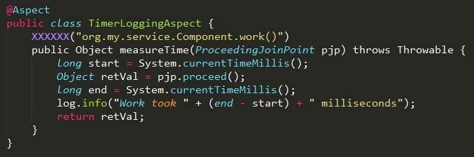
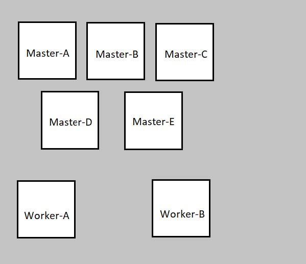
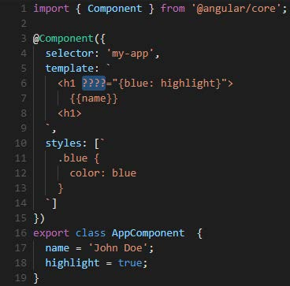

# CodinGame for Work: Java, Spring Framework, Angular 2+, Git, Docker
- Campaign: Java, Spring Framework, Angular 2+, Git, Docker - Senior
- Language: French

## Question 1: [Web] @ControllerAdvice
Quel est le rôle de la classe ci-dessous dans une application web Spring ?

```
@ControllerAdvice
public class ExceptionAdvice {
    @ExceptionHandler({UserNotFoundException.class})
    public final ResponseEntity<String> handleException(UserNotFoundException ex, WebRequest request) {
        return new ResponseEntity<>(null, new HttpHeaders(), HttpStatus.NOT_FOUND);
    }
}
```

**Réponse**
- [x] Intercepter les exceptions `UserNotFoundException` non capturées et traduire le statut HTTP 500 par défaut en un statut plus descriptif
- [ ] Empêcher les exceptions `UserNotFoundException` d'être lancées par les contrôleurs
- [ ] Définir `UserNotFoundException` et le rendre disponible pour que d'autres classes puissent l'utiliser
- [ ] Fournir des logs supplémentaires lorsqu'une exception `UserNotFoundException` est lancée

<br>

## Question 2: [AOP] Logging aspect
Vous souhaitez créer un aspect qui permet de logguer le temps d'exécution d'une méthode de votre
module métier. Vous n'avez pas besoin de vous occuper des exceptions.

Par quelle annotation devriez-vous remplacer XXXXXX ?



**Réponse**
- [x] `@Around`
- [ ] `@Before`
- [ ] `@After`
- [ ] `@AfterReturning`

<br>

## Question 3: [Core] Constructeurs Autowired
Quel énoncé est correct concernant l'annotation @Autowired(required=true) sur les constructeurs
d'une classe ?

**Réponse**
- [ ] `@Autowired` n'est utilisable que sur les champs et les méthodes setter
- [x] `@Autowired` peut être ajouté sur un constructeur mais ce n'est pas nécessaire
- [ ] `@Autowired` peut être ajouté sur autant de constructeurs que souhaité

<br>

## Question 4: [Web] STOMP
Quel est le nom du protocole, basé sur du texte, utilisé par Spring pour envoyer des messages par
Websockets ?

**Réponses correctes**
- STOMP
- Streaming Text Oriented Messaging Protocol

<br>

## Question 5: git bisect
Quel est l'usage typique de la commande git bisect ?

**Réponse**
- [ ] Pour diviser l'historique de commit d'un projet afin de filtrer les logs
- [ ] Pour recherche un fichier particulier commité dans le dépôt
- [x] Pour retrouver quel commit dans votre historique de projet a introduit un bug
- [ ] Pour trouver le dernier commit sans récupérer les changements du dépôt distant

<br>

## Question 6: Option -m
Quelle option de la ligne de commande permet de spécifier un commentaire de commit à l'exécution de
git commit ?

**Réponse**
- [x] -m
- [ ] -i
- [ ] -l
- [ ] -a

<br>

## Question 7: git diff
Vous avez modifié localement le code du fichier `index.html`.
Quelle commande exécuter pour voir quels changements de code seront ajoutés quand vous passerez le fichier dans la "staging area" ?

**Réponse**
- [ ] git status index.html
- [x] git diff index.html
- [ ] git show index.html   
- [ ] git show --diff index.html

<br>

## Question 8: git clone files
On suppose que la branche par défaut est la branche master. 
À l'exécution de git clone `<remote repository>`, quels fichiers sont ajoutés au répertoire local ?

**Réponse**
- [ ] Les fichiers du premier commit de la branche master du dépôt distant
- [ ] Aucun fichier n'est récupéré, seul un dépôt vide est créé
- [x] La dernière version des fichiers de la branche master du dépôt distant
- [ ] La dernière version des fichiers de la branche la plus récente du dépôt distant

<br> 

### Question 9: git reflog
Un utilisateur tiers a accidentellement rebasé de manière incorrecte et a fait un "force push" de son rebase. Vous faites un pull de ces changements dans votre dépôt local et vous perdez tout l'historique des commits.
Quelle commande pouvez-vous exécuter pour lister tous les changements du dépôt afin que vous puissiez revenir à un état antérieur correspondant à une référence donnée ?

**Réponses correctes**
- git reflog
- reflog

<br>

## Question 10: Dockerfile : EXPOSE
Quel est le rôle de l'instruction EXPOSE dans un Dockerfile ?

**Réponse**
- [x] Elle indique au démon Docker que le container sera à l'écoute d'un port donné
- [ ] Elle indique au démon Docker qu'un répertoire spécifique du container sera exposé au niveau de l'hôte
- [ ] Elle indique au démon Docker qu'il devra se mettre à l'écoute de tous les ports du container
- [ ] EXPOSE n'est pas une instruction possible du Dockerfile
- [ ] Elle indique au démon Docker qu'il devra router l'ensemble du trafic du container vers l'hôte par utilisation de NAT

<br>

## Question 11: Dockerfile : choix entre CMD et ENTRYPOINT
Y-a-t-il des différences entre les instructions CMD et ENTRYPOINT d'un Dockerfile ?

**Réponse**
- [ ] Il n'y a pas de différences. Ce sont des alias.
- [x] Oui, CMD permet de spécifier une commande par défaut qui sera exécutée seulement si aucune commande n'est spécifiée au lancement d'un container alors que les arguments de ENTRYPOINT seront toujours exécutés
- [ ] Oui, ENTRYPOINT doit toujours être utilisé en conjonction avec CMD alors que CMD peut être utilisé seul
- [ ] Oui, ENTRYPOINT permet de spécifier le répertoire par défaut dans lequel s'exécutera la commande spécifiée par CMD

<br>

## Question 12: Docker troubleshooting : inspection du réseau Docker
Pour investiguer un problème, vous avez besoin de lister les ports publiés par un container.
Quelle commande pourriez-vous utiliser dans cette situation ?
Plusieurs réponses attendues.

**Réponse**
- [x] docker port
- [x] docker ps
- [ ] docker network
- [ ] docker list port

<br>

## Question 13: Docker network : utilisation d'un serveur DNS custom
Quelle commande permet de créer un container avec pour serveur DNS personnalisé 8.8.8.8 ?

**Réponse**
- [x] docker container create --dns=8.8.8.8
- [ ] docker container create --custom-dns=8.8.8.8
- [ ] docker container create --add-dns=8.8.8.8
- [ ] docker container create --resolve=8.8.8.8

<br>

## Question 14: Docker swarm : incident sur cluster
On considère le cluster Docker swarm suivant:



Qu'arrivera-t-il si Master-A, Master-B et Master-E tombent ?

**Réponse**
- [ ] Rien de plus, le cluster continue de tourner comme si les masters étaient
toujours en cours d'exécution
- [ ] Tous les services / containers s'arrêtent
- [x] Les services existants continuent de fonctionner mais le scheduler ne peut pas déployer de nouveaux services ou redéployer des services en échec
- [ ] Toutes les fonctionnalités du cluster sont opérantes parce qu'il reste des masters en cours d'exécution mais les performances de scheduling sont dégradées

<br>

## Question 15: Test Driven Development (TDD)
Parmi ces deux procédures de développement, laquelle préconisez-vous ?

Procédure #1:
- Ecrire des tests pour la nouvelle fonctionnalité "F" 
- Tester que "F" ne fonctionne pas Implémenter "F"
- Tester que "F" fonctionne correctement

Procédure #2:
- Implémenter la nouvelle fonctionnalité "F" 
- Ecrire des tests pour "F" 
- Tester que "F" fonctionne correctement

**Réponse**
- [x] Procédure #1
- [ ] Procédure #2

<br>

## Question 16: Dependency Inversion Principle (DIP)
Les abstractions (ex : interfaces) ne doivent pas dépendre des détails (implémentations concrètes). Les
détails doivent dépendre des abstractions.

**Réponse**
- [x] Vrai
- [ ] Faux


<br>

## Question 17: Opérateur sur les bits : >>
Quel est le résultat de l'opération 2 >> 1 ?

**Réponse**
- [ ] 0
- [x] 1
- [ ] 2
- [ ] 3
- [ ] 4

<br>

## Question 18: Création d'une chaîne de caractères
Voici deux manières de créer une chaîne de caractères: 

`String s = "Test" ` \
`String s = newString("Test")`

Quelle affirmation est correcte concernant les différences entre ces deux méthodes ?

**Réponse**
- [ ] L'option 1 est plus performante
- [ ] L'option 2 est plus performante
- [x] L'objet 1 est variable (mutable), l'objet 2 est immuable (immutable)
- [ ] L'objet 2 est variable (mutable), l'objet 1 est immuable (immutable)

<br>

## Question 19: HashMap avec objet variable en tant que clef
Dans une HashMap, une classe variable (mutable) est utilisée comme clef.

Quelle proposition est vraie ?

**Réponse**
- [ ] Peu importe que la clef soit variable ou immuable (immutable), la HashMap se comporte de la même manière
- [ ] Utiliser des clefs variables peut poser un problème de performance : la HashMap recalcule les valeurs hash des clefs à chaque fois qu'une entrée est recherchée
- [x] Une HashMap peut être peu fiable lorsque l'on utilise des clefs variables car leurs valeurs hash peut dépendre de l'état de l'objet clef

<br>

## Question 20: Duodigits
On appelle "duodigit" un nombre entier dont la représentation décimale n'utilise pas plus de deux chiffres différents. 

Par exemple `12` , `110` , `-33333` sont des duodigits, mais `102` ne l'est pas.

Implémentez la méthode `isDuoDigit(number)` qui renvoie un string:

`y` si `number` est un duodigt `n` dans le cas contraire.

EXEMPLE:

Number \
1

Number \
2020

Number \
-2021

Result \
y

Result \
y

Result \
n

**Réponse**
```
import java.util.*;
import java.io.*;
import java.math.*;
class Solution {
    public static String isDuoDigit(int number) {
        // Write your code here
        // To debug: System.err.println("Debug messages...");
        boolean result = Integer.toString(Math.abs(number)).chars().distinct().count() <= 2;
        return result ? "y" : "n";
    }

    /* Ignore and do not change the code below */
    // #region main
    public static void main(String args[]) {
        Scanner in = new Scanner(System.in);
        int number = in.nextInt();
        PrintStream outStream = System.out;
        System.setOut(System.err);
        String result = isDuoDigit(number);
        System.setOut(outStream);
        System.out.println(result);
    }
    // #endregion
}
```

<br>

## Question 21: Correction simple
La méthode `sumRange` devrait retourner la somme des entiers compris entre 10 et 100 inclusifs contenus dans le tableau passé en paramètre.

Corrigez la méthode `sumRange`.

Note : le paramètre `ints` n'est jamais null.

```
import java.util.*;
import java.io.*;
import java.nio.*;
import java.math.*;

class Solution {
    static int sumRange(int[] ints) {
        int sum = 0;
        for (int i = 0; i < ints.length; i++) {
            int n = ints[i];
            if (n >= 10 && n <= 100) {
                sum += n;
            }
        }
        return sum;
    }
}

```

Si vous connaissez le patron de conception (design pattern) utilisé dans ce bout de code, saisissez son nom dans le champ texte (1 mot seulement).

**Réponse**

- Singleton

<br>

## Question 22: Expression booléenne simple
`A.a(int i, int j)` devrait retourner true si un des arguments est égal à 1 ou si leur somme est égale à 1. 

Par exemple :

A.a(1, 5) retourne true \
A.a(2, 3) retourne false \
A.a(-3, 4) retourne true

**Réponse**

```
class A {
    static boolean a(int i, int j) {
        return (i + j == 1 || (i == 1 || j == 1));
    }
}
```
<br>

## Question 23: Reconstitution de message
On vous demande de reconstituer un message qui a été coupé en morceaux.

Implémentez la méthode `rebuildMessage(parts)` qui reçoit en paramètre un tableau de chaînes de caractères.
Chaque élément de parts a été découpé à partir d'un seul et même message. 
Vous devez reconstituer le message original, à partir des règles suivantes : \
le message original commence toujours par le caractère A et finit par le caractère Z deux parties peuvent être rattachées lorsque le dernier caractère de la première partie est égal au premier caractère de la deuxième partie. lors de la combinaison de deux parties, on ne conserve qu'un exemplaire du caractère de liaison (par exemple " A---b " + " b---Z " donne " A---b---Z et non " A---bb---Z ").

`rebuildMessage` doit retourner le message reconstitué.

Contraintes : \
chaque premier caractère est unique parmi parts chaque partie contient au moins 2 caractères et au plus 1000 caractères la solution existe forcément et est unique parts n'est jamais null , contient au moins un élément et au plus 100 éléments.

EXEMPLES: \
Parties \
Ab \
bcZ \
Message \
AbcZ \
Parties \
*====# \
X-+-+-+-+-+-Z \
#______X \
A.........* \
Message \
A.........*====#______X-+-+-+-+-+-Z \

**Réponse**
```
import java.util.*;
import java.io.*;
import java.math.*;
class Solution {
    public static String rebuildMessage(String[] parts) {
        Map<Character, Character> charLinks = new HashMap<>();

        for (String part : parts) {
            char firstChar = part.charAt(0);
            char lastChar = part.charAt(part.length() - 1);
            charLinks.put(firstChar, lastChar);
        }

        StringBuilder reconstructedMessage = new StringBuilder();
        char currentChar = 'A'; 
        while (charLinks.containsKey(currentChar)) {
            reconstructedMessage.append(currentChar);
            currentChar = charLinks.get(currentChar);
        }

        reconstructedMessage.append(currentChar);

        return reconstructedMessage.toString();
    }

    /* Ignore and do not change the code below */
    // #region main
    public static void main(String args[]) {
        Scanner in = new Scanner(System.in);
        int partsCount = in.nextInt();
        if (in.hasNextLine()) {
            in.nextLine();
        }
        String[] parts = new String[partsCount];
        for (int i = 0; i < partsCount; i++) {
            parts[i] = in.nextLine();
        }
        PrintStream outStream = System.out;
        System.setOut(System.err);
        String message = rebuildMessage(parts);
        System.setOut(outStream);
        System.out.println(message);
    }
    // #endregion
}
```

<br>

## Question 24: Directive structurelle
Parmi les propositions suivantes, laquelle n'est pas un directive structurelle d'Angular ?

**Réponse**
- [ ] ngIf
- [ ] ngFor
- [ ] ngSwitch
- [x] ngUnless

<br>

## Question 25: Nouvelle application Angular
Quelle ligne de commande permet de créer une nouvelle application Angular ?

**Réponse**
- [x] ng new appName
- [ ] ng start appName
- [ ] npm start appName
- [ ] npm create appName

<br>

## Question 26: Route avec accès non-autorisé
Comment pouvez-vous protéger une certaine route contre les accès non-autorisés ?

**Réponse**
- [ ] en utilisant un UrlMatcher
- [x] en utilisant des "route guards"
- [ ] en utilisant un service spécifique
- [ ] en traitant des événements de sécurité

<br>

## Question 27: Passage de données d'enfant vers parent
Quelle syntaxe utiliseriez-vous pour passer une donnée d'un fils vers son composant parent ?

**Réponse**
- [ ] Output
- [ ] Input
- [x] @Output()
- [ ] @Input()

<br>

## Question 28: Écouter les événements de l'hôte
Quel décorateur peut-on utiliser pour écouter les événements de l'élément hôte depuis une directive fille?

**Réponse**
- [x] `@HostListener`
- [ ] `@Listener`
- [ ] `@Target`
- [ ] `@Event`

<br>

## Question 29: Détection de modifications d'un composant
Quelle est la stratégie de détection de modifications par défaut pour un composant ?

**Réponse**
- [ ] `Component Change Detection`
- [ ] `ChangeDetection`
- [ ] `OnPush`
- [x] `Default`

<br>

## Question 30: Directive ngClass
Quelle directive built-in Angular peut-on utiliser pour remplacer `????` à la ligne 6 pour d'appliquer la classe `blue` de manière conditionnelle ?



**Réponses correctes**
- [ ] `[ngClass]`
- [ ] `[ ngClass ]`

<br>

## Question 31: @Input/@Output composant parent
On vous demande de créer un composant Angular nommé `DisplayComponent` et ayant `displaycomponent` pour sélecteur.

Il doit utiliser le composant `VoterComponent` (sélecteur = `voter-component`) dont le code est fourni.

`DisplayComponent` a 3 champs publics nommés `question`, `yesAnswer` et `noAnswer`.  \
Ils représentent une question posée à l'utilisateur et les choix de réponse possibles affichés dans `VoterComponent`.

DisplayComponent doit utiliser `VoterComponent` en tant qu'enfant et doit lui passer `question`, `yesAnswer` et `noAnswer` en entrée.

Quand l'utilisateur vote, `VoterComponent` créé un événement de type `boolean` vers un `@Output` nommé `output`.

Vous devez afficher le résultat du vote dans DisplayComponent dans un `<div>` avec `id=lastVote` : \
si `output` est vrai, alors on affiche la valeur de `yesAnswer`, sinon on affiche la valeur de `noAnswer`.

Notes : 
Un bloc de "Preview" est disponible pour vous permettre de débugguer votre code. \
Il affiche votre composant ci-dessous. Vous pouvez l'ouvrir et le modifier à votre guise. \
Ce bloc de "Preview" n'est pas pris en compte dans le calcul du score de votre code. \


**Réponse**
```
// Angular 8.x code
import { Component, Input, NgModule, Output, EventEmitter } from '@angular/core';

@Component({
selector:'display-component',
template: `
    <div id="lastVote">{{answer}}</div>
    <voter-component
        [question]="question"
        [yesAnswer]="yesAnswer"
        [noAnswer]="noAnswer"
        (outuput)="setVote($event)">
    </voter-component>
`
})
export class DisplayComponent {
    public question = "Too easy?"
    public yesAnswer = "Yes";
    public noAnswer = "No";
    public answer= "Yes";
    @Output() output: EventEmitter<boolean> = new EventEmitter<boolean>();
    setVote(event: boolean){
        return this.answer = event ? this.yesAnswer : this.noAnswer;
        this.output.emit(event);
    }
}

// VoterComponent: do not change
@Component({
    selector:'voter-component',
    template: `
        {{question}}
        <button (click)="vote(true)">{{yesAnswer}}</button>
        <button (click)="vote(false)">{{noAnswer}}</button>
    `
})

export class VoterComponent {
    @Input()
    public question: string;
    @Input()
    public yesAnswer: string;
    @Input()
    public noAnswer: string;
    @Output()
    public output = new EventEmitter<boolean>();

    public vote(vote: boolean): void {
        this.output.emit(vote);
    }
}

// #region Preview
@Component({
    template: `<display-component></display-component>`
})
export class PreviewComponent { }
// #endregion Preview

// #region Module declaration - Do not Change
@NgModule({
    declarations: [PreviewComponent, DisplayComponent, VoterComponent],
    entryComponents: [PreviewComponent]
})
export class PreviewModule { }
// #endregion Module declaration
```

<br>

## Question 32: Utilisation des pipes (percent, currency, date)
On vous demande de terminer le composant TransactionDetailsComponent.  \
Vous devez uniquement modifier la partie template du composant.
L'objectif de ce composant est d'afficher la date, le montant, la devise et les frais associés à une transaction, chacun dans un format spécifique. \
Vous devez afficher 3 divs:

### Le div "Fee" (frais) 
L'id de ce div doit être `fee`. \
Il affiche les frais `fee` associés à la transaction sous forme de pourcentage : \
S'il y a moins de 2 chiffres pour la partie entière de la valeur en pourcentage, vous devez combler avec des zéros à gauche.  \
S'il y a moins de 2 chiffres dans la partie décimale, vous devez comblez avec zéros à droite.  \
S'il y a plus de 3 chiffres dans la partie décimale, vous devez arrondir à 3 chiffres. On utilise un point `.` en tant que séparateur décimal.
Par exemple `0.031234` s'affiche `03.123%`.

### Le div "Amount" (montant)
L'id de ce div doit être `amount`.  \
Il affiche les frais `amount` et la devise `currency` de la transaction. Le
symbole de la devise associée au code `currency` (par exemple `€` pour `EUR`) est affiché avant les frais. \
Les frais sont formattés comme suit : \
S'il y a moins de 9 chiffres pour la partie entière, vous devez combler avec des zéros à gauche. Le séparateur des milliers doit être une virgule `,`.  \
S'il y a moins de 2 chiffres dans la partie décimale, vous devez comblez avec zéros à droite. S'il y a plus de 2 chiffres dans la partie décimale, vous devez arrondir à 2 chiffres. \
Par exemple `currency=EUR`, `amount=312.562` s'affiche `€000,000,312.56`.

### Le div "Time" (date)
L'id de ce div doit être `time`. La date et l'heure de la transaction doivent être affiché dans ce format inhabituel : 'ww: yyyy MMMMM dd hh-mm-ss'

Notes : 
Un bloc de "Preview" est disponible pour vous permettre de débugguer votre code. \
Il affiche votre composant ci-dessous. Vous pouvez ouvrir ce bloc et le modifier à votre guise. \
Le bloc de "Preview" n'est pas pris en compte dans le calcul du score de votre code. 


**Réponse**
```
import { Component, Input, NgModule } from '@angular/core';
import { CommonModule } from '@angular/common';

@Component({
  selector: 'transaction-component',
  template: `
    <div id="fee">{{ formattedFee }}</div>
    <div id="amount">{{ formattedAmount }}</div>
    <div id="time">{{ timeOfTransaction | date:'ww: yyyy MMMMM dd HH-mm-ss' }}</div>
  `
})
export class TransactionDetailsComponent {
  @Input() currency: string;
  @Input() timeOfTransaction: Date;
  @Input() amount: number;
  @Input() fee: number;

  get formattedFee(): string {
    const feePercentage = this.fee * 100;
    const formattedFee = feePercentage.toLocaleString('en-US', {
      minimumIntegerDigits: 2,
      minimumFractionDigits: 3,
      maximumFractionDigits: 3
    });
    return `${formattedFee}%`;
  }

  get formattedAmount(): string {
    const formattedAmount = this.amount.toLocaleString('en-US', {
      style: 'currency',
      currency: this.currency,
      minimumIntegerDigits: 9,
      minimumFractionDigits: 2,
      maximumFractionDigits: 2
    });
    return formattedAmount;
  }
}

// #region Preview
@Component({
  template: `<transaction-component [fee]=0.02 [amount]=123.45 [currency]="EUR" [timeOfTransaction]="getPresetDate()">
  </transaction-component>
  `
})
export class PreviewComponent {
  public getPresetDate(): Date {
    return new Date(1997, 6, 1, 12, 32);
  }
}
// #endregion Preview

// #region Module declaration - Do not Change
@NgModule({
  imports: [CommonModule],
  declarations: [PreviewComponent, TransactionDetailsComponent],
  entryComponents: [PreviewComponent]
})
export class PreviewModule {}
// #endregion Module declaration
```